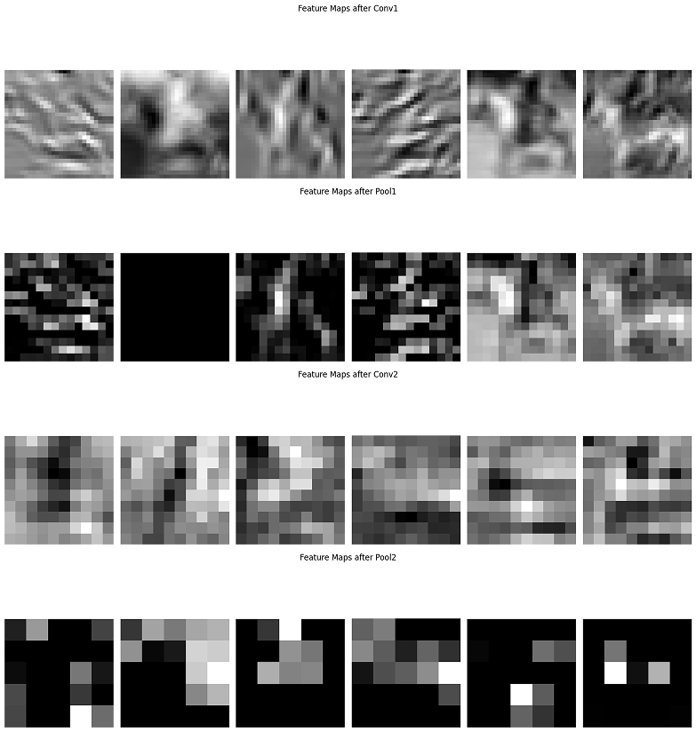
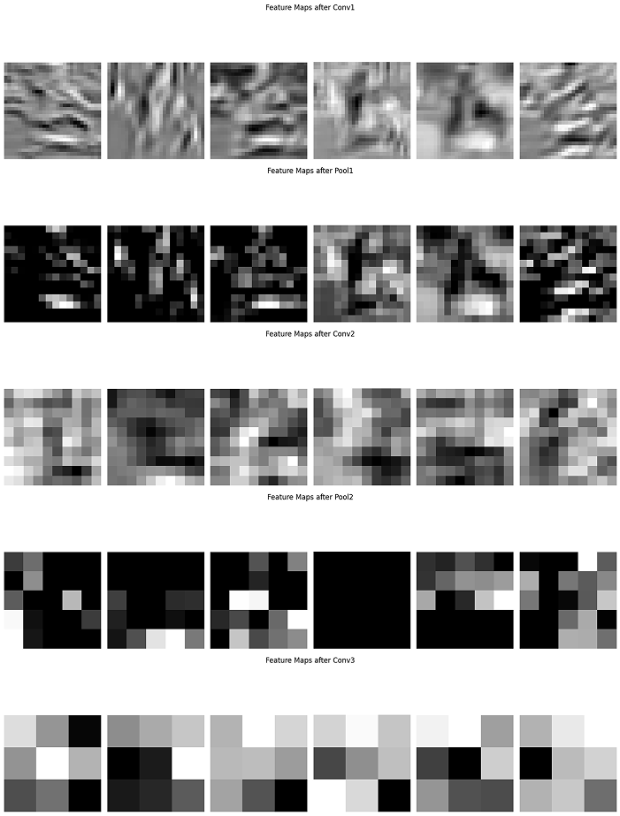
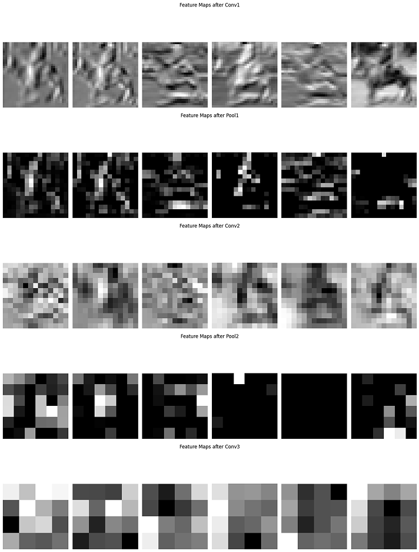
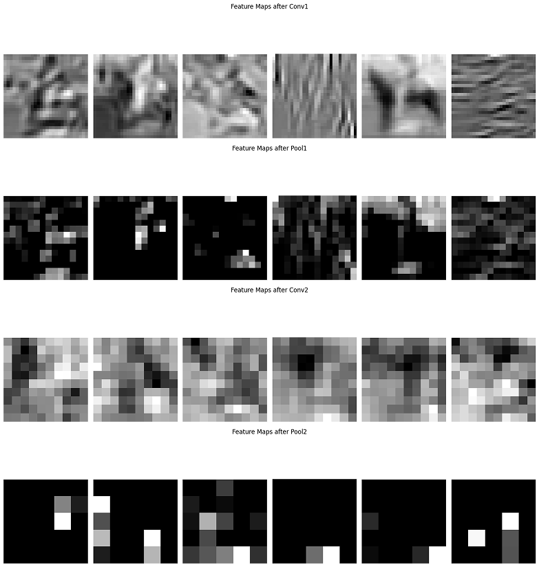

## Overview
This project explores different Convolutional Neural Network (CNN) architectures for image classification. The model has been modified through three iterations to improve performance and robustness. These changes include increasing the number of filters, adjusting kernel sizes, and integrating batch normalization and dropout to enhance training stability.

## Architecture Evolution
### Initial Model
The original model is a simple CNN with two convolutional layers, followed by fully connected layers.

| Layer Type     | Name  | Input Shape  | Output Shape  | Kernel/Units | Activation | Additional Info |
|---------------|-------|--------------|--------------|--------------|------------|----------------|
| Conv2D        | conv1 | (3, 32, 32)  | (6, 28, 28)  | (5x5)        | ReLU       | 6 filters      |
| MaxPool2D     | pool1 | (6, 28, 28)  | (6, 14, 14)  | (2x2)        | -          | Stride 2       |
| Conv2D        | conv2 | (6, 14, 14)  | (16, 10, 10) | (5x5)        | ReLU       | 16 filters     |
| MaxPool2D     | pool2 | (16, 10, 10) | (16, 5, 5)   | (2x2)        | -          | Stride 2       |
| Flatten       | -     | (16, 5, 5)   | (400)        | -            | -          | -              |
| Dense (FC)    | fc1   | (400)        | (120)        | 120          | ReLU       | -              |
| Dense (FC)    | fc2   | (120)        | (84)         | 84           | ReLU       | -              |
| Dense (FC)    | fc3   | (84)         | (10)         | 10           | Softmax    | Output layer   |

**Visualizing Feature Maps**

 

### Setup 1: Increasing Filters and Adding Layers
In this version, the number of filters is increased, and an additional convolutional layer is introduced.

| Layer Type     | Name  | Input Shape  | Output Shape  | Kernel/Units | Activation | Additional Info |
|---------------|-------|--------------|--------------|--------------|------------|----------------|
| Conv2D        | conv1 | (3, 32, 32)  | (32, 28, 28) | (5x5)        | ReLU       | Increased filters from 6 → 32 |
| MaxPool2D     | pool1 | (32, 28, 28) | (32, 14, 14) | (2x2)        | -          | Stride 2       |
| Conv2D        | conv2 | (32, 14, 14) | (64, 10, 10) | (5x5)        | ReLU       | Increased filters from 16 → 64 |
| MaxPool2D     | pool2 | (64, 10, 10) | (64, 5, 5)   | (2x2)        | -          | Stride 2       |
| Conv2D        | conv3 | (64, 5, 5)   | (128, 3, 3)  | (3x3)        | ReLU       | Increased filters from 64 → 128 |
| GlobalAvgPool2D | gap | (128, 3, 3)  | (128)        | -            | -          | Reduces dimensions |
| Dense (FC)    | fc1   | (1600)       | (512)        | 512          | ReLU       | Increased neurons from 120 → 512 |
| Dense (FC)    | fc2   | (512)        | (256)        | 256          | ReLU       | Increased neurons from 84 → 256 |
| Dense (FC)    | fc3   | (256)        | (10)         | 10           | Softmax    | Output layer   |

**Visualizing Feature Maps**

 

### Setup 2: Modifying Kernel Sizes
This setup reduces kernel sizes to improve feature extraction efficiency.

| Layer Type     | Name  | Input Shape  | Output Shape  | Kernel/Units | Activation | Additional Info |
|---------------|-------|--------------|--------------|--------------|------------|----------------|
| Conv2D        | conv1 | (3, 32, 32)  | (32, 30, 30) | (3x3)        | ReLU       | Reduced kernel from 5x5 → 3x3 |
| Conv2D        | conv2 | (32, 15, 15) | (64, 13, 13) | (3x3)        | ReLU       | Reduced kernel from 5x5 → 3x3 |
| Conv2D        | conv3 | (64, 6, 6)   | (128, 4, 4)  | (3x3)        | ReLU       | Same kernel size, adjusted shape |
| Dense (FC)    | fc1   | (2304)       | (512)        | 512          | ReLU       | Increased neurons from 120 → 512 |
| Dense (FC)    | fc2   | (512)        | (256)        | 256          | ReLU       | Increased neurons from 84 → 256 |
| Dense (FC)    | fc3   | (256)        | (10)         | 10           | Softmax    | Output layer   |

**Visualizing Feature Maps**

 

### Setup 3: Adding Batch Normalization & Dropout
This version enhances stability and prevents overfitting.

| Layer Type     | Name  | Input Shape  | Output Shape  | Kernel/Units | Activation | Additional Info |
|---------------|-------|--------------|--------------|--------------|------------|----------------|
| Conv2D        | conv1 | (3, 32, 32)  | (32, 28, 28) | (5x5)        | ReLU       | 32 filters |
| BatchNorm2D   | bn1   | (32, 28, 28) | (32, 28, 28) | -            | -          | - |
| Conv2D        | conv2 | (32, 14, 14) | (64, 10, 10) | (5x5)        | ReLU       | Increased filters from 16 → 64 |
| BatchNorm2D   | bn2   | (64, 10, 10) | (64, 10, 10) | -            | -          | - |
| Dropout       | drop1 | (256)        | (256)        | -            | -          | Dropout 0.5 |
| Dense (FC)    | fc3   | (256)        | (10)         | 10           | Softmax    | Output layer |

**Visualizing Feature Maps**

 

## Results

| Set Up         | Model Description | Accuracy |
|---------------|------------------|----------|
| Initial Set Up | 2 Conv2D layers (6, 16 filters, ReLU). 2 MaxPool2D layers. 3 Dense layers (120, 84, 10 units, ReLU/Softmax). | 63.01% |
| Setup 1 | 3 Conv2D layers (32, 64, 128 filters, ReLU). 2 MaxPool2D layers. Global Average Pooling. 3 Dense layers (512, 256, 10 units, ReLU/Softmax). | 71.87% |
| Setup 2 | 3 Conv2D layers (32, 64, 128 filters, 3x3 kernel, ReLU). 2 MaxPool2D layers. Global Average Pooling. 3 Dense layers (512, 256, 10 units, ReLU/Softmax). | 72.58% |
| Setup 3 | 2 Conv2D (5x5, ReLU, 32 & 64 filters). 2 BatchNorm2D layers. 2 MaxPool2D layers. Flatten. 3 Dense layers (512, 256, 10 units, ReLU/Softmax). 2 Dropout layers (0.5). | 75.97% |

